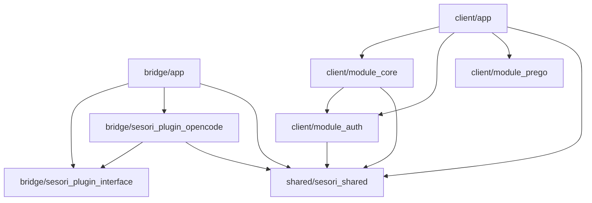
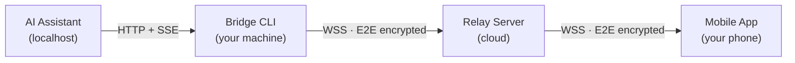

# Sesori Apps Monorepo

## What is Sesori?

AI coding assistants like [OpenCode](https://github.com/opencode-ai/opencode) run as local processes on your development machine. That means you need to be at your desk to see what they're doing, review their output, or answer their questions.

Sesori removes that constraint. It lets you **monitor and interact with AI coding sessions from your phone** — browse projects, read conversation history, respond to questions, and watch progress in real time.

### How it works

A lightweight **bridge CLI** runs on your laptop alongside the AI assistant. It connects to a **relay server** over WebSocket. Your **mobile app** connects to the same relay. The relay routes encrypted traffic between them — it sees connection metadata (auth tokens, public keys) but never application data.

```
AI Assistant        Bridge CLI         Relay Server         Mobile App
(localhost)    <--- HTTP/SSE --->   <--- WSS (E2E) --->   <--- WSS (E2E) --->
                    on your             in the               on your
                    machine             cloud                phone
```

The bridge talks to the AI assistant over localhost HTTP and SSE, wraps everything in end-to-end encryption, and forwards it through the relay to your phone. The phone can send requests back the same way — ask questions, trigger actions, browse sessions — all encrypted end-to-end.

## Repository Structure

```
bridge/                     # Dart workspace — Bridge CLI + plugin system
  app/                      # CLI relay server
  sesori_plugin_interface/  # Abstract plugin contract
  sesori_plugin_opencode/   # OpenCode backend plugin
client/                     # Flutter workspace — mobile client
  app/                      # Flutter UI shell
  module_core/              # Pure Dart business logic
  module_auth/              # Auth & token lifecycle
  module_prego/              # Prego design system — theme, fonts, icons, UI components
shared/
  sesori_shared/            # Shared crypto & protocol types
  no_slop_linter/           # Custom Dart lint rules (dev tooling)
```

`bridge/` and `client/` are independent Dart pub workspaces with separate dependency resolution. The packages under `shared/` are referenced via path by both: `sesori_shared` carries the crypto and protocol types, while `no_slop_linter` is a custom analyzer plugin pulled in as a dev dependency to enforce the repo's lint rules.

## Dependency Graph



`shared/no_slop_linter` is omitted above — it is a dev-only analyzer plugin, not a runtime dependency.

## Data Flow

### Runtime topology

At runtime, four components form a pipeline:



### How each hop works

**Bridge ↔ AI Assistant (localhost)**
The bridge talks to the AI assistant over plain HTTP on `127.0.0.1`. It fetches projects and sessions via REST, and subscribes to a Server-Sent Events (SSE) stream for real-time updates (new messages, status changes, questions). A random 256-bit password protects the local connection.

**Bridge ↔ Relay (WebSocket)**
The bridge opens a persistent WebSocket to the relay server and authenticates with an OAuth access token. All application data sent over this connection is encrypted — the relay only sees opaque binary frames and routes them by user identity.

**Phone ↔ Relay (WebSocket)**
The mobile app opens its own WebSocket to the same relay, authenticates the same way, and receives binary frames destined for it. The relay is a stateless router.

**Phone ↔ Bridge (end-to-end, through the relay)**
When a phone connects, it performs an **X25519 Diffie-Hellman key exchange** with the bridge. Both sides derive a shared secret via HKDF-SHA256, and the bridge sends a random **room key** encrypted with that secret. From that point on, every message — HTTP requests, responses, SSE events — is encrypted with **XChaCha20-Poly1305** using the room key. The relay never has access to the key material.

### Message types

| Direction | What travels | Example |
|---|---|---|
| Phone → Bridge | HTTP requests (encrypted) | `GET /project`, `GET /session/:id/message` |
| Bridge → Phone | HTTP responses (encrypted) | Project list, session messages |
| Bridge → Phone | SSE events (encrypted) | New message, session status change, question asked |
| Phone → Bridge | SSE subscribe/unsubscribe | Start/stop receiving events for a session |
| Both | Key exchange, resume, rekey | Connection lifecycle |

## Security

- **End-to-end encryption** — All application data (projects, sessions, messages, events) is encrypted with XChaCha20-Poly1305 between phone and bridge. The relay routes ciphertext and connection metadata but cannot read user content.
- **Ephemeral key exchange** — Each connection uses ephemeral X25519 keypairs. The DH-derived secret protects room key delivery, and the ephemeral keys are discarded afterward.
- **Session resume** — The room key is persisted on the phone so reconnects skip the key exchange. A `rekey_required` signal forces a fresh exchange when needed.
- **Local protection** — The bridge protects its localhost connection to the AI assistant with a random 256-bit password, never transmitted over the network.

## Prerequisites

- **Flutter** — mobile workspace; the exact version is pinned in [`.tool-versions`](.tool-versions)
- **Dart SDK** — bridge workspace (a pure Dart workspace); ships with the pinned Flutter version, so no separate install is needed
- **asdf** — recommended for version management; reads [`.tool-versions`](.tool-versions) automatically

## Getting Started

```sh
git clone <repo-url>
cd sesori_apps_monorepo

# Install bridge dependencies
cd bridge && dart pub get

# Install mobile dependencies
cd ../client && flutter pub get
```

## Common Tasks

Each directory (bridge/, client/, or shared/) ships a Makefile with the same core targets — run them from that directory. They resolve the Flutter-bundled Dart SDK via the version pinned in .tool-versions and the default asdf install path (`~/.asdf/installs/flutter/<version>`), so they bypass whatever is on your PATH — provided you've run `asdf install`.

| Target | What it does |
|---|---|
| `make pub-get` | Resolve dependencies for the workspace |
| `make codegen` | Run `build_runner` across modules (freezed, json_serializable, …) |
| `make analyze` | Static analysis across modules |
| `make test` | Run unit tests across modules |

`client/` adds design-system helpers for the Prego module:

| Target | What it does |
|---|---|
| `make generate-assets` | Regenerate the Tabler/VESPR icon-font Dart bindings |
| `make generate-tokens` | Sync Figma design tokens into `module_prego` |

The root `Makefile` manages cross-workspace versioning:

| Target | What it does |
|---|---|
| `make bump-version TYPE=patch\|minor\|major` | Bump bridge + mobile versions in lockstep (or pass `VERSION=X.Y.Z`) |
| `make bump-version-check` | Preview the version bump without writing changes |

## Bridge Install

If you want the packaged bridge CLI instead of building from source, use the bridge-specific install docs:

- [bridge/INSTALL.md](bridge/INSTALL.md) — shell installers, `npx @sesori/bridge`, update behavior, and uninstall steps
- [bridge/RELEASING.md](bridge/RELEASING.md) — release verification and manual release-test flow

Quick options:

```bash
# npm bootstrap (macOS / Linux / Windows)
npx @sesori/bridge --version

# If PATH has not refreshed in this shell yet, open a new terminal
# or run ~/.local/share/sesori/bin/sesori-bridge directly on macOS/Linux.
sesori-bridge

# shell installer (macOS / Linux)
curl -fsSL https://raw.githubusercontent.com/sesori-ai/sesori_apps_monorepo/main/install.sh | bash
```

On Windows, use:

```powershell
irm https://raw.githubusercontent.com/sesori-ai/sesori_apps_monorepo/main/install.ps1 | iex
```

The installers and npm bootstrap both create the same managed runtime under `~/.local/share/sesori/` on macOS/Linux or `%LOCALAPPDATA%\sesori\` on Windows.
On macOS/Linux, a symlink is created at `~/.local/bin/sesori-bridge`. If `~/.local/bin` is already in your PATH, the command is available immediately. Otherwise, the installer adds it to your shell config and you may need to open a new terminal.

## Bridge Uninstall

To fully remove the packaged bridge runtime, delete the managed install directory:

- macOS / Linux: `~/.local/share/sesori/` and `~/.local/bin/sesori-bridge`
- Windows: `%LOCALAPPDATA%\sesori\`

If you used the npm bootstrap path, `npm uninstall @sesori/bridge` only removes the npm package. It does not remove the managed Sesori install.

## Workspace Docs

- [bridge/README.md](bridge/README.md) — bridge CLI, plugin system, codegen, and testing
- [bridge/ARCHITECTURE.md](bridge/ARCHITECTURE.md) — bridge layered architecture (Foundation → API → Repository → Service)
- [client/README.md](client/README.md) — Flutter client, module structure, and testing
- [shared/no_slop_linter/README.md](shared/no_slop_linter/README.md) — custom lint rules and how they're wired in

## License

This repository is source-available under the Functional Source License, Version 1.1, Apache 2.0 Future License (`FSL-1.1-ALv2`).

That means you may use, modify, and redistribute the software for permitted purposes, but you may not use it to launch a competing product or service.

On the second anniversary of the date each version is made available, that version automatically becomes available under Apache License 2.0.

See [LICENSE](LICENSE) for the full terms.
