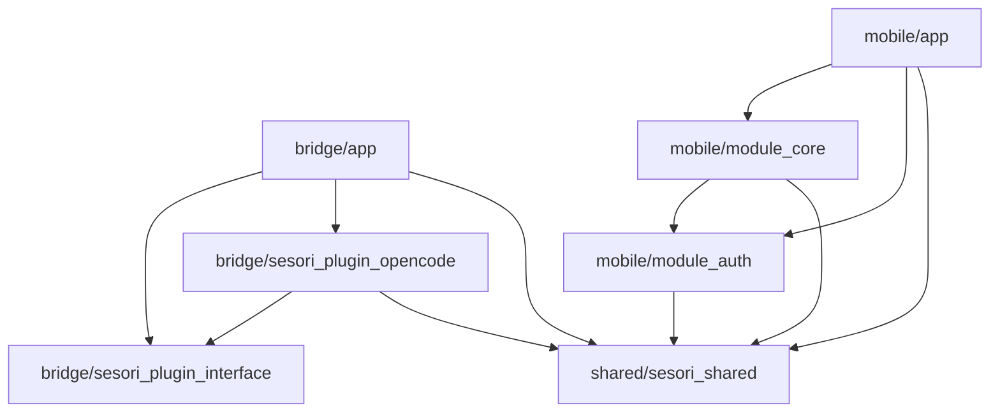

# Sesori Apps Monorepo

Sesori bridges AI coding assistants (like OpenCode) to mobile devices over an encrypted relay. This monorepo contains the bridge CLI, mobile Flutter client, and shared crypto/protocol library.

## Repository Structure

```
bridge/                     # Dart workspace — Bridge CLI + plugin system
  app/                      # CLI relay server
  sesori_plugin_interface/  # Abstract plugin contract
  sesori_plugin_opencode/   # OpenCode backend plugin
mobile/                     # Dart workspace — Flutter mobile client
  app/                      # Flutter UI shell
  module_core/              # Pure Dart business logic
  module_auth/              # Auth & token lifecycle
shared/
  sesori_shared/            # Shared crypto & protocol types
```

`bridge/` and `mobile/` are independent Dart workspaces with separate dependency resolution. `shared/sesori_shared` is referenced via path by both workspaces.

## Dependency Graph



## Prerequisites

- **Dart 3.11.2** — bridge workspace
- **Flutter 3.41.4-stable** — mobile workspace
- **asdf** — recommended for version management

## Getting Started

```sh
git clone <repo-url>
cd sesori_apps_monorepo

# Install bridge dependencies
cd bridge && dart pub get

# Install mobile dependencies
cd ../mobile && dart pub get
```

## Workspace Docs

- [bridge/README.md](bridge/README.md) — bridge CLI, plugin system, codegen, and testing
- [mobile/README.md](mobile/README.md) — Flutter client, module structure, and testing
