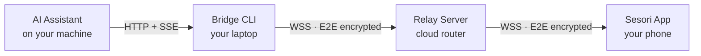

<p align="center">
  <a href="https://sesori.com" target="_blank" rel="noopener">
    <strong>Sesori</strong>
  </a>
</p>

<h1 align="center">Run your AI coding sessions from anywhere.</h1>

<p align="center">
  Sesori is the mobile cockpit for <a href="https://opencode.ai" target="_blank" rel="noopener">OpenCode</a>, <a href="https://cursor.com" target="_blank" rel="noopener">Cursor</a>, <a href="https://github.com/openai/codex" target="_blank" rel="noopener">Codex</a>, and other AI coding assistants.<br/>
  Leave your laptop. Take the session.
</p>

<p align="center">
  
</p>

<p align="center">
  <a href="https://apps.apple.com/app/sesori/id6760642500">
    
  </a>
  <a href="https://play.google.com/store/apps/details?id=com.sesori.app">
    
  </a>
  <a href="https://github.com/sesori-ai/sesori_apps_monorepo/releases">
    
  </a>
  <a href="LICENSE">
    
  </a>
</p>

<p align="center">
  <a href="https://discord.gg/5KBC8dV9uR">
    
  </a>
  <a href="https://x.com/sesori_ai">
    
  </a>
</p>

<p align="center">
  <a href="#install">Get started</a> ·
  <a href="https://docs.sesori.com" target="_blank" rel="noopener">Docs</a> ·
  <a href="docs/HOW_IT_WORKS.md">How it works</a> ·
  <a href="docs/ARCHITECTURE.md">Architecture</a> ·
  <a href="docs/SECURITY.md">Security</a> ·
  <a href="docs/CONTRIBUTING.md">Contribute</a>
</p>

---

<a id="install"></a>

## Install in 3 steps

### 1. Download the Sesori app

<a href="https://apps.apple.com/app/sesori/id6760642500">
  
</a>
<a href="https://play.google.com/store/apps/details?id=com.sesori.app">
  
</a>

Requires iOS 15 or later, or Android 8.0 or later.

### 2. Install the Bridge CLI on your machine

The Bridge is a small source-available command-line tool that connects the app to OpenCode, Cursor, Codex, and other AI coding assistants.

**macOS / Linux:**

```bash
curl -fsSL https://sesori.com/install.sh | bash
```

**Windows (PowerShell):**

```powershell
irm https://sesori.com/install.ps1 | iex
```

Prefer npm or bun? You can also bootstrap the Bridge with `npx @sesori/bridge` or `bunx @sesori/bridge`. It installs the same managed runtime under the hood.

### 3. Start the Bridge

```bash
sesori-bridge
```

Sign in with the **same account** on your phone and your machine. The two pair automatically over the encrypted relay, even on different networks.

> **Full walkthrough:** prerequisites, OpenCode setup, headless VM instructions, and troubleshooting are in [docs/GETTING_STARTED.md](docs/GETTING_STARTED.md).

---

## What you can do

| Feature | What it means |
|---|---|
| **Browse projects & sessions** | See your OpenCode, Cursor, Codex, and other AI coding projects and every active session from your phone. |
| **Keep agents moving** | Answer questions, approve steps, and stop or restart tasks without returning to your desk. |
| **Review code and PR status** | Read diffs and keep tabs on pull requests without opening your laptop. |
| **Voice or type** | Talk to your assistant naturally or use the keyboard — whatever works in the moment. |
| **Real-time notifications** | Get pinged the moment your AI needs you back or a long-running task finishes. |
| **End-to-end encrypted** | Your code, prompts, and responses stay between your phone and your machine. |

---

## How it works

A lightweight Bridge runs on your laptop alongside OpenCode. It connects to a relay server over WebSocket, and your phone connects to the same relay. The relay routes encrypted traffic between them — it never sees your application data.



Your laptop and phone perform an ephemeral X25519 key exchange, then encrypt every message with XChaCha20-Poly1305. The relay only routes opaque binary frames.

> **Dive deeper:** [docs/HOW_IT_WORKS.md](docs/HOW_IT_WORKS.md)

---

## Why you can trust it

- **End-to-end encryption.** All application data between your phone and laptop is encrypted with XChaCha20-Poly1305.
- **Ephemeral key exchange.** Each connection uses a fresh X25519 Diffie-Hellman keypair; the relay never holds the room key.
- **Local-first.** Your source code, prompts, and AI responses stay on your machine. We only store the account and routing metadata needed to pair your devices. Push notification previews may include a short snippet of an event; see [docs/SECURITY.md](docs/SECURITY.md) for details.
- **Source-available bridge.** The Bridge and the client protocol are in this repo. You can audit the code that runs on your machine.
- **Source-available license.** Released under the Functional Source License, Version 1.1, Apache 2.0 Future License (`FSL-1.1-ALv2`).

> **Security details:** [docs/SECURITY.md](docs/SECURITY.md)

---

## Supported AI assistants

| Assistant | Status | Notes |
|---|---|---|
| [OpenCode](https://opencode.ai) | Available | Deep native integration. |
| Claude Code | Coming soon | Plugin architecture already supports multi-assistant backends. |
| OpenAI Codex CLI | Beta | Enabled by default in an upcoming release. |
| Cursor | Beta | ACP-based Cursor plugin; enabled by default in an upcoming release. |
| Windsurf | Coming soon | Planned. |

---

## Repository overview

```
sesori_apps_monorepo/
├── bridge/     # Pure Dart workspace — Bridge CLI + backend plugins
├── client/     # Flutter workspace — mobile & desktop shells
├── shared/     # Cross-product crypto & protocol primitives
└── docs/       # Deep-dive guides
```

- `bridge/app` is the headless CLI that runs on your laptop.
- `bridge/sesori_plugin_*` packages implement support for each AI assistant backend.
- `client/app` is the Flutter mobile shell.
- `client/desktop` is the in-development desktop companion.
- `shared/sesori_shared` holds the encryption primitives and wire types used by both sides.

> **Full architecture:** repo structure, dependency graph, and layered design are in [docs/ARCHITECTURE.md](docs/ARCHITECTURE.md).

---

## Built for developers

- **Plugin system.** New AI assistant backends live in their own plugin package without touching the mobile app or core bridge.
- **Headless bridge.** The Bridge is usable without a GUI, ideal for remote machines, VMs, and server setups.
- **Cross-platform.** Mobile apps run on iOS and Android. Bridge CLI runs on macOS, Linux, and Windows.
- **Encrypted by default.** No optional VPN, no tunnel setup, no exposed ports on your laptop.

For where the project is headed, see [docs/VISION.md](docs/VISION.md) and [docs/ROADMAP.md](docs/ROADMAP.md).

> **Want to hack on it?** See [docs/CONTRIBUTING.md](docs/CONTRIBUTING.md).

---

## License & support

This repository is source-available under the [Functional Source License, Version 1.1, Apache 2.0 Future License](LICENSE) (`FSL-1.1-ALv2`).

- **Docs:** [docs.sesori.com](https://docs.sesori.com)
- **Discord:** [discord.gg/5KBC8dV9uR](https://discord.gg/5KBC8dV9uR)
- **Email:** [hello@sesori.com](mailto:hello@sesori.com)
- **Issues:** [GitHub Issues](https://github.com/sesori-ai/sesori_apps_monorepo/issues)

---

<p align="center">
  <a href="https://apps.apple.com/app/sesori/id6760642500">Download for iOS</a> ·
  <a href="https://play.google.com/store/apps/details?id=com.sesori.app">Download for Android</a> ·
  <a href="https://docs.sesori.com/get-started/quickstart">Read the Quickstart</a>
</p>
