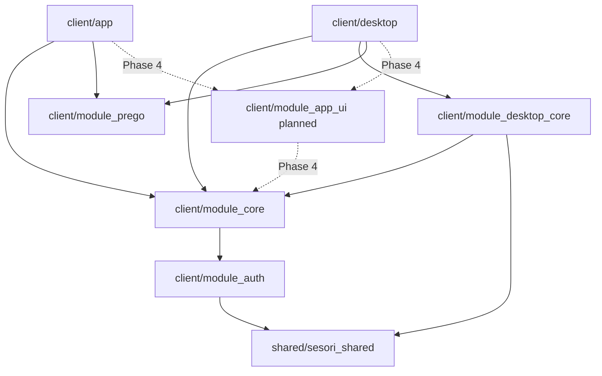

# Sesori Client Workspace

Flutter workspace containing the mobile product, the in-development desktop
product, and the shared client modules they consume.

## Modules

| Module | Purpose |
|--------|---------|
| `app/` | Mobile Flutter shell: screens, routing, DI, and platform adapters. |
| `desktop/` | Desktop Flutter shell: presentation, DI, and concrete desktop platform adapters. |
| `module_core/` | Pure Dart shared business logic: transport, APIs, repositories, services, cubits, and routing models. |
| `module_desktop_core/` | Pure Dart desktop business logic: bridge supervision, control orchestration, trackers, services, and cubits. |
| `module_auth/` | Authentication, OAuth, token lifecycle, secure storage seams, and authenticated HTTP. |
| `module_prego/` | Shared Flutter design system: theme, fonts, icons, and components. |

`module_app_ui` is planned for Phase 4. It will hold shared Flutter screens and
widgets without owning product-shell DI or desktop process supervision.

## Dependency Direction



Never reverse these dependencies. The product shells may depend on
`module_auth` in their pubspecs only to call `configureAuthDependencies(getIt)`;
all other auth access goes through interfaces exported by `module_core`.

## Architecture

`module_core` follows the repository-wide layers:

```text
module_core/lib/src/
├── foundation/    platform and transport abstractions, logging, concurrency
├── api/           relay/auth-server data access
├── repositories/  aggregation and DTO-to-domain mapping
├── services/      shared business logic and event processing
├── cubits/        feature state management
└── routing/       surface-independent route models and auth redirects
```

`module_desktop_core` uses the same dependency direction for desktop concerns:

```text
module_desktop_core/lib/src/
├── foundation/    desktop platform interfaces and control transport
├── api/           process, instance, update, and storage boundaries
├── repositories/  desktop data aggregation and mapping
├── trackers/      state derived from control/process events
├── services/      desktop supervision and lifecycle decisions
├── control/       Layer-4 control-message dispatch
└── cubits/        desktop state management
```

Flutter widgets and platform plugins stay in `app/` or `desktop/`. Cubits stay
in the appropriate pure Dart module, not in either product shell.

## Dependency Injection

Mobile initializes three phases:

1. Mobile platform adapters
2. `configureAuthDependencies(getIt)`
3. `configureCoreDependencies(getIt)`

Desktop initializes four phases:

1. Desktop platform adapters for `module_core` and `module_desktop_core`
2. `configureAuthDependencies(getIt)`
3. `configureCoreDependencies(getIt)`
4. `configureDesktopCoreDependencies(getIt)`

## Getting Started

```bash
# From client/: resolve the complete workspace.
dart pub get

# Run a product shell.
(cd app && flutter run)
(cd desktop && flutter run -d macos)
```

The exact Flutter version is pinned in the repository root `.tool-versions`.

## Analyze And Test

Run all workspace checks through the Makefile:

```bash
make analyze
make test
```

Target individual members when needed:

```bash
(cd app && flutter test)
(cd desktop && flutter test)
(cd module_core && dart test)
(cd module_desktop_core && dart test)
(cd module_auth && dart test)
(cd module_prego && flutter test)
```

## Code Generation

After modifying Freezed models or injectable annotations, run `make codegen`
from `client/`, or run `dart run build_runner build` in the affected member.
Generated `*.freezed.dart`, `*.g.dart`, and `*.config.dart` files must not be
edited manually.

## Related

- [Bridge workspace](../bridge/README.md) - laptop-side CLI and plugin system
- [Client agent rules](AGENTS.md) - detailed boundaries and conventions

## License

This workspace is source-available under the Functional Source License, Version
1.1, Apache 2.0 Future License (`FSL-1.1-ALv2`). See the repository root
[LICENSE](../LICENSE) for the full terms.
