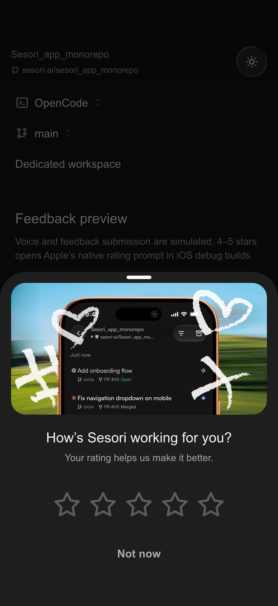
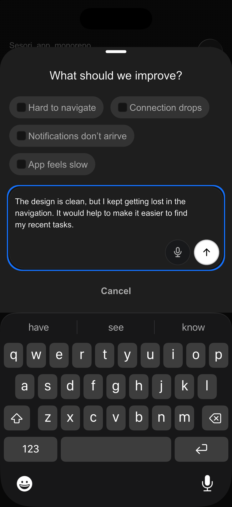
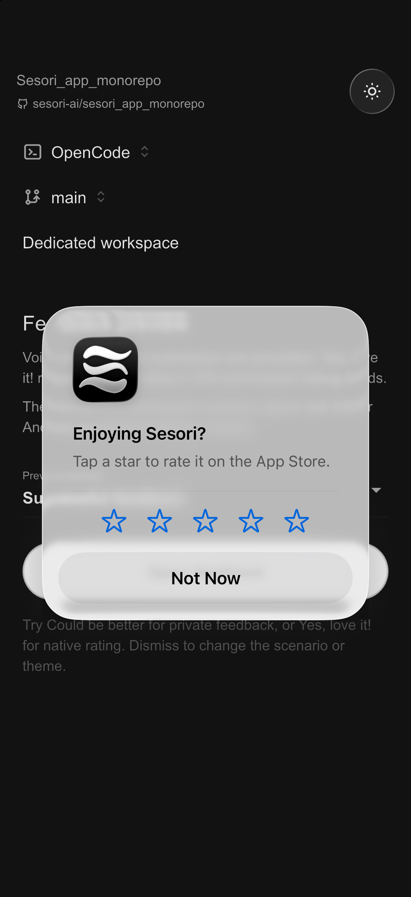
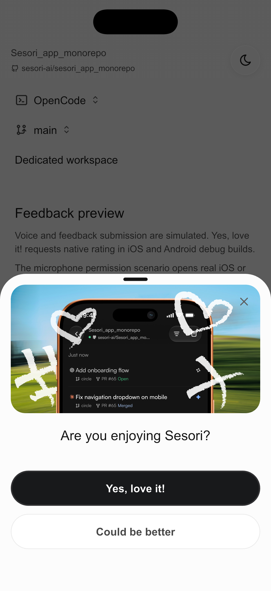
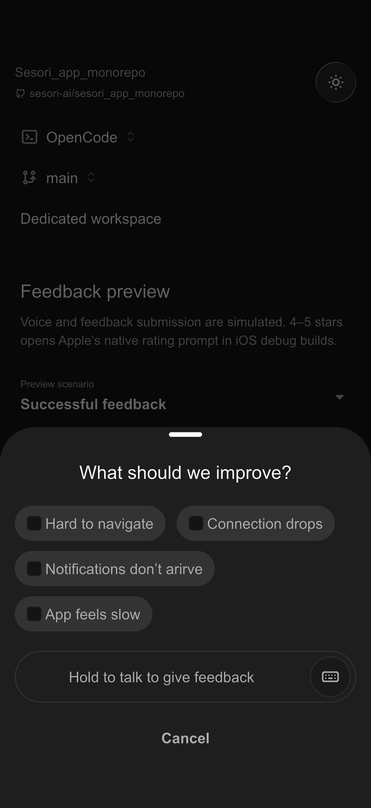
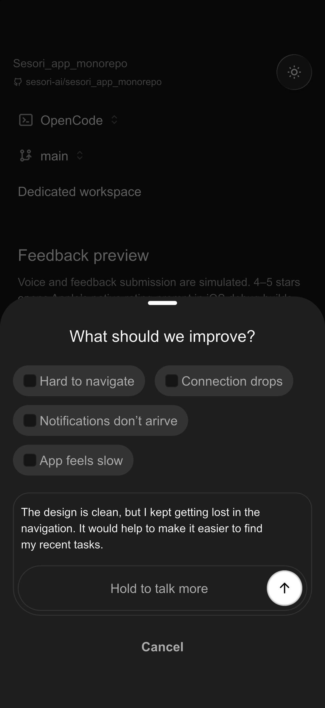
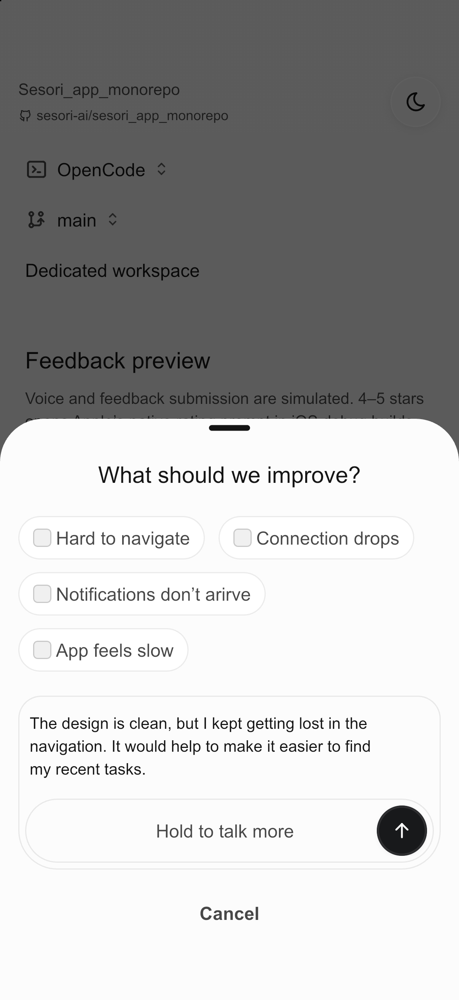

# Feedback UI preview

An interactive Flutter prototype of the [Figma feedback flow](https://www.figma.com/design/NILKXLD9cwuWHhLnGqPqeJ/Sesori?node-id=5527-8368).
This is a design and engineering handoff. Voice and private submission are
simulated. **Yes, love it!** plays the coordinated Figma celebration, then
requests the platform's native review UI in iOS/Android debug builds.

## Simulator screenshots

Captured from the preview on an iPhone 17 Pro simulator running iOS 26.5:

| Rating · dark | Keyboard · dark | Apple native rating |
| --- | --- | --- |
|  |  |  |

The updated entry uses **Yes, love it!** and **Could be better**.

| Rating · light | Celebration and native handoff |
| --- | --- |
|  | [Dark preview](feedback_preview/rating-celebration.mp4) · [Light preview](feedback_preview/rating-celebration-light.mp4) |

Feedback input corrected to [Figma `5035:11030`](https://www.figma.com/design/NILKXLD9cwuWHhLnGqPqeJ/Sesori?node-id=5035-11030):

| Voice first | Transcribed · dark | Transcribed · light |
| --- | --- | --- |
|  |  |  |

## Run locally

Use the Flutter version pinned in the repository's `.tool-versions` (currently
3.47.2-stable). From `client/`, run `flutter pub get`, then from `client/app/`:

```sh
flutter devices
flutter run -d <ios-simulator-id> -t test/playbook/feedback_flow_playbook.dart
```

The preview opens directly into the rating sheet. Dismiss it to access the
scenario selector and the sun/moon theme button, then tap **Open feedback** to
restart. No sign-in, bridge, connected coding harness, or feedback backend is
needed. A real software keyboard is used for typing. Ordinary voice scenarios
are simulated without microphone access; the explicitly selected **Microphone
permission / settings** scenario opens real iOS/Android permission or settings UI.

## What to try

| Action | Expected preview behavior |
| --- | --- |
| Tap Yes, love it! | Start the button and hero together. Preserve the opening 1.2 seconds, shorten the quiet tail to 300 ms, then close the sheet in 200 ms before requesting native review: approximately 1.7 seconds in total. The OS controls any further presentation delay. |
| Tap Could be better | Open the existing private feedback flow immediately, with issue choices and voice/keyboard input. |
| Tap either choice repeatedly during celebration | Keep the original action; request native review once after the sheet is fully removed. |
| Close, tap the scrim, or swipe the sheet down | Dismiss without submission or a pending review request; reopening starts fresh. |
| Send after choosing Could be better | Send is immediately available beside the keyboard button; no issue or text is required. |
| Select one or several issues | Toggle selection; category-only feedback can be submitted. |
| Switch to keyboard | Edit multiline text; show the annotated blue focus ring. Keep sheet content above the keyboard while extending the sheet background behind its rounded corners. |
| Hold the voice area, then release | Show the existing Prego waveform, shimmering `Transcribing…` label (static with reduced motion), then sample text. Send is disabled during recording/transcription, then becomes the only trailing button inside the voice pill. Tap the transcript to edit it. |
| Hold to talk more | Preserve the current transcript while recording/transcribing, then append the next sample. Send remains the single trailing action. |
| Tap the voice area twice | Accessible preview shortcut: start, then finish the simulated recording. |
| Submit feedback | Show loading, close the sheet, and show the Figma confirmation toast. No content leaves the preview. |
| Select Submission fails once | First submission preserves the draft and shows Retry; retry succeeds. |
| Select Microphone permission / settings | Open native permission/settings UI in iOS/Android debug builds. Already-authorized access continues the first gesture; returning from native UI requires a fresh gesture. Restricted iOS access stays in the preview. A retryable Android denial returns to the preview; Settings opens only when Android no longer offers another permission prompt. |
| Select Transcription fails once | Show the shared top error toast, preserve the draft and issue choices, and allow a fresh recording or keyboard input. |
| Drag a held recording toward Cancel, then release | Show the red cancellation state and discard only that recording. Drag back before releasing to continue transcription; the direct Cancel recording action also retains the existing draft. |
| Enable Reduce Motion before or during celebration | Skip or finish the celebration promptly and request native review after closing. |
| Open the preview outside an iOS/Android debug build | The native-rating request reports that the native hook is unavailable; no custom review dialog is substituted. |

Check dark/light themes, larger text, a narrow phone, keyboard appearance and
dismissal, category wrapping, long feedback, cancellation during a simulated
operation, and repeating the flow. Private-feedback success must never open the
native-rating prompt.

Apple owns the native prompt's copy, appearance, star selection, and dismissal.
StoreKit does not report whether a rating was submitted. Its development-mode
prompt lets us verify the native UI; this is not proof of a published review.
[Apple documents development and TestFlight behavior here](https://developer.apple.com/documentation/storekit/appstore/requestreview%28in%3A%29-1q8qs).
The private-feedback success toast remains simulated.
It appears below the top navigation through the shared Prego presenter and
dismisses automatically after three seconds. Close or swipe up to dismiss sooner.

## Implementation boundaries

- The alternative entry point is `feedback_flow_playbook.dart`; production
  `lib/main.dart`, routes, settings, DI, and services are unchanged.
- All prototype state, fake delays, scenarios, and copy live under
  `test/playbook/`. Private feedback has no backend calls, real recording or
  transcription, analytics events, storage, or automatic prompting.
- A small `#if DEBUG` hook in `ios/Runner/AppDelegate.swift` registers
  `com.sesori.app/feedback_preview`. Its `requestReview` method calls StoreKit
  using the foreground `UIWindowScene`, after the Dart sheet's `completed`
  future resolves. It uses `AppStore.requestReview(in:)` on iOS 16+ and
  `SKStoreReviewController.requestReview(in:)` on the app's supported iOS 15.
  Release builds exclude this hook, and the
  normal product entry point does not call it. The same debug channel handles
  `requestMicrophoneAccess`. Android registers both preview handlers only when
  `BuildConfig.BUILD_TYPE == "debug"`, excluding Flutter profile builds too.
  Android uses Google Play Review 2.0.2 to request and launch the native flow.
  Completion does not establish that the OS displayed a prompt or accepted a rating.
  Permission/settings UI is real, while audio capture remains
  simulated. Late permission completion cannot begin a released or dismissed
  recording.
  The Runner Debug build configuration explicitly enables Swift's `DEBUG`
  compilation condition so the preview hook is available in simulator builds.
- Prego supplies the themes, icons, solid/glass buttons, composer decoration,
  waveform, scaffold, and success toast. The grabber-only sheet, issue pills,
  and animated rating artwork are private prototype widgets.
- The input follows Figma `5035:11030`: voice is the initial mode; a transcript
  reveals an editor with 20px top and 34px bottom corners, a 6px inset, an 8px
  text/footer gap, and a separate 56px-tall voice pill with one 44px Send action.
  Text uses 4px horizontal and 8px vertical padding, plus the design's 27px
  trailing clearance. Borders do not add to these content insets. Tapping text
  enters the keyboard variant (`5037:13617`), with 26px bottom corners,
  microphone/Send controls, and the annotated focus ring outside the border.
- The layered hero comes from Figma `5528:30768`: two 3× raster exports
  preserve the static background/phone treatments, while eight small SVGs keep
  the doodles and hearts sharp. Total new artwork is approximately 833 KiB.
  Assets use the app's existing image declaration and remain bundled even when
  the preview entry point is not used.
- `feedback_rating_motion.dart` translates the ten animated nodes' 31 tracks,
  including Figma's sampled spring easing. The button and hero share one
  controller and one timeline; the button adds no second platform press spring.
  Static artwork stays outside per-frame builders, image filters are baked, and
  animation uses transforms, opacity, button color and one bounded glow shader.
  In light mode the default uses Primary Alt’s `fgPrimary` fill,
  `textPrimaryOnWhite` label and 2px `alphaWhite10` border. The first authored
  color segment blends those colors smoothly into the pink celebration, then
  returns to Primary Alt’s dark fill and light label before sheet closure. Figma and
  Impeller differ slightly in the early soft-light glow; source blend settings
  and keyframes are preserved. Physical-device frame performance is unmeasured.
- The Figma label `Notifications don’t arirve` is preserved intentionally.
  Confirm the correction to `Notifications don’t arrive` before production.
- Figma comment #151 asks for voice and quick issue choices; both are included.
  Comment #150 questions the intermediate state: no extra thank-you sheet is
  inserted before native rating. The annotated blue focus ring is
  retained on the feedback editor.

## Motion behavior

The positive response preserves Figma's immediate button color/rotation/scale
and the main heart celebration. The approved timing refinement keeps the first
1.2 seconds at the authored pace and compresses only the remaining 800 ms into
300 ms. With the 200 ms sheet exit, native review is requested after about
1.7 seconds at normal speed. Both reduced-motion signals skip the celebration,
including when enabled during playback. The other flow motion remains:

- Sheet: 250 ms entrance with `Cubic(0.32, 0.72, 0, 1)`, and a 200 ms
  fast-start exit using the flipped `Cubic(0.23, 1, 0.32, 1)`.
- Content: 220 ms fade with a small vertical offset; outgoing content loses
  pointer access and semantics. The rating handoff resizes the existing sheet
  during that same transition. Voice and inline failures share this treatment.
- Confirmation: the shared top-toast presenter owns placement and the three-second
  timeout. The card settles downward from a small offset and 96% scale in 220 ms,
  then fades and contracts upward in 160 ms. Reduced motion uses only the fade.
  These changes also apply to existing production Prego toasts. The static card
  is isolated behind a repaint boundary; motion changes only transform and opacity,
  with no animated blur or repeated layout. The toast schedules no frames at rest.
- Chips: pointer-down feedback, synchronized 160 ms border/checkbox/text
  selection, and 100 ms press release. Composer actions reveal over 160 ms,
  with neighboring content adjusting alongside them.
- Typing: the editor reserves three visible lines and scrolls longer drafts.
  Keyboard insets follow the platform directly, with no extra padding tween.
- Reduced motion: sheet travel is removed, including when the preference
  changes while it is open; content retains fades, press scaling is suppressed,
  and changing the preference preserves the private draft. Shared Prego iOS
  buttons also stop ongoing press motion.
- Loading: shared iOS buttons retain their press wrapper while disabled, so
  release finishes smoothly. Existing iOS timing and haptics are preserved.

## Engineering follow-up

After reviewing the experience, extract the agreed presentation into shared
`module_app_ui` widgets and put business state in `module_core` with shell-owned
composition. Do not copy prototype delays or scenario switches into the
production flow.

Production work still needs:

1. A confirmed feedback destination and authenticated submission contract, with
   typed failure/retry handling and truthful delivery acknowledgement.
2. Existing `VoiceInputCubit` / `VoiceTranscriptionService` integration, scoped
   recording cleanup, editable transcription, and real-device validation.
3. The agreed prompting rule (proposed: two minutes of foreground use, then a
   quiet return to the task list), cooldown persistence, and manual entry.
4. A production native-review adapter and platform testing. Both current hooks
   are debug-only. Apple’s prompt has been exercised; Android compilation and
   Play-distributed device testing remain unverified. Wait for full sheet
   dismissal; OS suppression is not a failed review.
5. Store-policy resolution for the requested positive-rating-only native
   prompt. The UI prototype preserves the requested Yes/native and
   Could be better/private split; this is not an assertion of store compliance. See
   [Google's guidance](https://developer.android.com/guide/playcore/in-app-review)
   and [Apple's guidelines](https://developer.apple.com/app-store/review/guidelines/#app-store-reviews).
6. Production localization, relevant regression documentation, and required
   client/service/native verification before release.

## Verification

```sh
# From client/app
flutter test test/playbook/feedback_flow_playbook_test.dart test/playbook/feedback_celebration_test.dart test/playbook/feedback_motion_test.dart test/playbook/feedback_motion_tuning_test.dart test/playbook/feedback_voice_states_test.dart
dart analyze
```

Verified locally on 2026-09-08 with Flutter 3.47.2 / Dart 3.13.2:

- All 57 combined flow, celebration, motion, tuning and voice-state tests pass.
  The positive route shares one timeline, preserves the opening pace, locks both
  choices, and requests native review once after 1.5 seconds of celebration and
  complete sheet removal. Closing mid-celebration cancels the request.
- Both reduced-motion flags work initially and during celebration. The private
  route supports category-only or empty feedback, draft-preserving retry,
  simulated transcription, cancellation, and tap-to-edit. A 320 × 568 viewport
  with 1.5× text and keyboard insets remains usable. Native-channel failures and
  mocked iOS/Android microphone-permission recovery retain explicit outcomes.
- Motion tuning replays the coordinated celebration with an editable duration;
  whole-flow replay enters private feedback and never requests native review.
  Existing voice, shared toast, shimmer and composer checks remain covered.
- The confirmation integration check verifies placement below the top navigation
  and automatic removal after the three-second reading interval. Twenty shared
  popup tests pass, covering entry/exit, an interrupted entrance, close/swipe,
  replacement, both reduced-motion signals and live preference changes, accessible
  announcement, and no scheduled frames while the toast is idle or dismissed.
- Shared Prego button checks pass: seven native widget tests, two Chrome tests,
  and the owning module analyzer. See `docs/regression/prego-button-interactions.md`.
- The app analyzer passes. Formatting and the final playbook analyzer pass.
- The iOS simulator build passes, including the Swift StoreKit hook.
- Latest simulator coverage includes the shortened celebration through Apple’s
  actual native prompt, both entry choices, dark/light sheets, and the private
  editor with its software keyboard. The updated recording is linked above.
- Earlier manual simulator coverage: private issue selection,
  typing with the software keyboard, focus ring and keyboard avoidance,
  simulated recording/transcription, private success toast, category-preserving
  submission failure and retry, and Apple's actual native rating prompt.
- Input correction verified in a separate iPhone 17 Pro simulator: voice-first
  entry, recording/transcribing, dark/light transcript with one Send action,
  tap-to-edit with the software keyboard and focus ring, actual text edits,
  and transcript-only submission through the replacement Send action.
- Rating choices, issue, and composer actions expose single labeled accessibility
  controls. Full VoiceOver navigation remains a team review item.

StoreKit presentation was exercised in an iOS debug build. Android native
compilation and device permission dialogs remain unverified locally. Real audio
capture/transcription, Play Review device presentation, backend delivery, and production
prompt/cooldown behavior remain production follow-up work.
