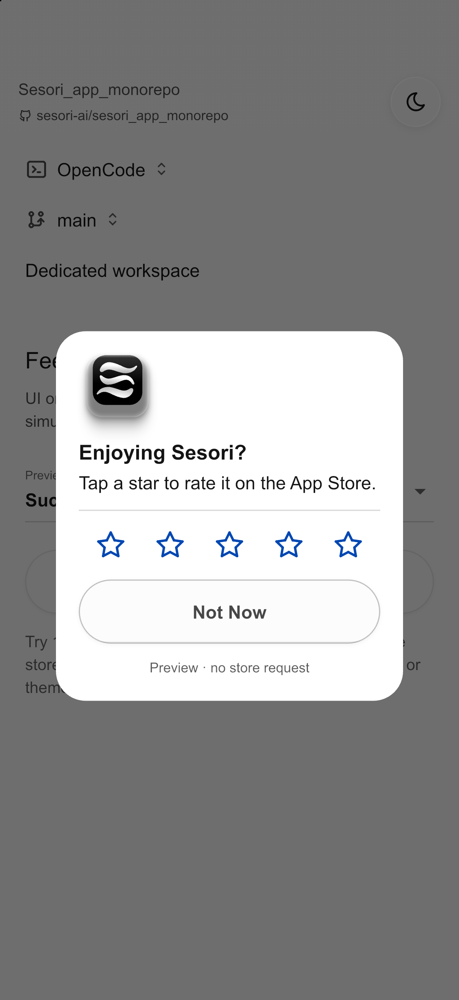

# Feedback UI preview

An interactive Flutter prototype of the [Figma feedback flow](https://www.figma.com/design/NILKXLD9cwuWHhLnGqPqeJ/Sesori?node-id=4616-40748).
This is a design and engineering handoff, not a connected product feature.

## Simulator screenshots

Captured from the preview on an iPhone 17 Pro simulator running iOS 26.5:

| Rating · dark | Keyboard · dark | Native mock · light |
| --- | --- | --- |
|  |  |  |

## Run locally

Use the Flutter version pinned in the repository's `.tool-versions` (currently
3.47.2-stable). From `client/`, run `flutter pub get`, then from `client/app/`:

```sh
flutter devices
flutter run -d <ios-simulator-id> -t test/playbook/feedback_flow_playbook.dart
```

The preview opens directly into the rating sheet. Dismiss it to access the
scenario selector and the sun/moon theme button, then tap **Open feedback** to
restart. No sign-in, bridge, connected coding harness, microphone permission,
or feedback backend is needed. A real software keyboard is used for typing.

## What to try

| Action | Expected preview behavior |
| --- | --- |
| Select 1, 2, or 3 stars | Open private feedback with issue choices and voice/keyboard input. |
| Select 4 or 5 stars | Close the rating sheet, then open the labeled Figma store-review mock. |
| Tap Not now, Cancel, the scrim, or swipe the sheet down | Dismiss without submission; reopening starts a fresh draft. |
| Select one or several issues | Toggle selection; category-only feedback can be submitted. |
| Switch to keyboard | Edit multiline text; show the annotated blue focus ring. |
| Hold the voice area, then release | Show the existing Prego waveform, simulated transcription, then editable sample text. |
| Tap the voice area twice | Accessible preview shortcut: start, then finish the simulated recording. |
| Submit feedback | Show loading, close the sheet, and show the Figma confirmation toast. No content leaves the preview. |
| Select Submission fails once | First submission preserves the draft and shows Retry; retry succeeds. |
| Select Microphone permission denied | Show the permission error with a working keyboard alternative. No OS permission dialog is requested. |
| Select Transcription fails once | First transcription fails; Retry transcription inserts sample text. |
| Select Native review unavailable | Selecting 4–5 stars returns to the launcher with an explicit preview notice. |

Check dark/light themes, larger text, a narrow phone, keyboard appearance and
dismissal, category wrapping, long feedback, cancellation during a simulated
operation, and repeating the flow. Private-feedback success must never open the
store-review mock.

The native-review card is deliberately labeled **Preview · no store request**.
Selecting its stars only changes its local presentation; Done/Not Now closes it.
Neither this card nor the simulated confirmation proves real delivery.

## Implementation boundaries

- The alternative entry point is `feedback_flow_playbook.dart`; production
  `lib/main.dart`, routes, settings, DI, and services are unchanged.
- All prototype state, fake delays, scenarios, and copy live under
  `test/playbook/`. There are no API calls, real recording/transcription,
  analytics events, storage, automatic prompting, or new dependencies.
- Prego supplies the themes, icons, solid/glass buttons, composer decoration,
  waveform, scaffold, and success toast. The grabber-only sheet, issue pills,
  and stars are private prototype widgets.
- The exact artwork was exported from Figma node `4954:13069` at 3× resolution
  (1110 × 570). `assets/images/feedback_preview_hero.png` is included by the
  app's existing image-asset declaration; this adds approximately 376 KiB to
  that bundle even when the preview entry point is not used.
- The Figma label `Notifications don’t arirve` is preserved intentionally.
  Confirm the correction to `Notifications don’t arrive` before production.
- Figma comment #151 asks for voice and quick issue choices; both are included.
  Comment #150 questions the intermediate state: no extra thank-you sheet is
  inserted before the store-review mock. The annotated blue focus ring is
  retained on the feedback editor.

## Engineering follow-up

After reviewing the experience, extract the agreed presentation into shared
`module_app_ui` widgets and put business state in `module_core` with shell-owned
composition. Do not copy prototype delays, scenario switches, or the mock native
dialog into the production flow.

Production work still needs:

1. A confirmed feedback destination and authenticated submission contract, with
   typed failure/retry handling and truthful delivery acknowledgement.
2. Existing `VoiceInputCubit` / `VoiceTranscriptionService` integration, scoped
   recording cleanup, editable transcription, and real-device validation.
3. The agreed prompting rule (proposed: two minutes of foreground use, then a
   quiet return to the task list), cooldown persistence, and manual entry.
4. Real native review adapters and platform testing. Their owner must survive
   dismissal of Sesori's rating sheet; OS suppression is not a failed review.
5. Store-policy resolution for the requested positive-rating-only native
   prompt. The UI prototype preserves the user's selected 1–3/private and
   4–5/native split; this is not an assertion of store compliance. See
   [Google's guidance](https://developer.android.com/guide/playcore/in-app-review)
   and [Apple's guidelines](https://developer.apple.com/app-store/review/guidelines/#app-store-reviews).
6. Production localization, relevant regression documentation, and required
   client/service/native verification before release.

## Verification

```sh
# From client/app
flutter test test/playbook/feedback_flow_playbook_test.dart
dart analyze
```

Verified locally on 2026-09-07 with Flutter 3.47.2 / Dart 3.13.2:

- Nine focused widget tests pass: all five rating branches, category-only
  private submission, dismiss/reopen, draft-preserving retry, editable simulated
  transcription without automatic submission, and a 320 × 568 viewport with
  1.5× text and keyboard insets.
- The app analyzer passes. Formatting and the final playbook analyzer pass.
- The iOS simulator build passes. The final color adjustment was hot-reloaded
  and visually inspected in the running simulator.
- Manual simulator coverage: dark/light rating sheets, private issue selection,
  typing with the software keyboard, focus ring and keyboard avoidance,
  simulated recording/transcription, private success toast, category-preserving
  submission failure and retry, and selecting/dismissing the five-star mock.
- Star, issue, and composer actions expose single labeled accessibility
  controls. Full VoiceOver navigation remains a team review item.

The current request intentionally limits verification to the local UI and iOS
simulator. No real StoreKit, Play Review, Android, microphone, backend delivery,
or production prompt/cooldown behavior is claimed by this handoff.
