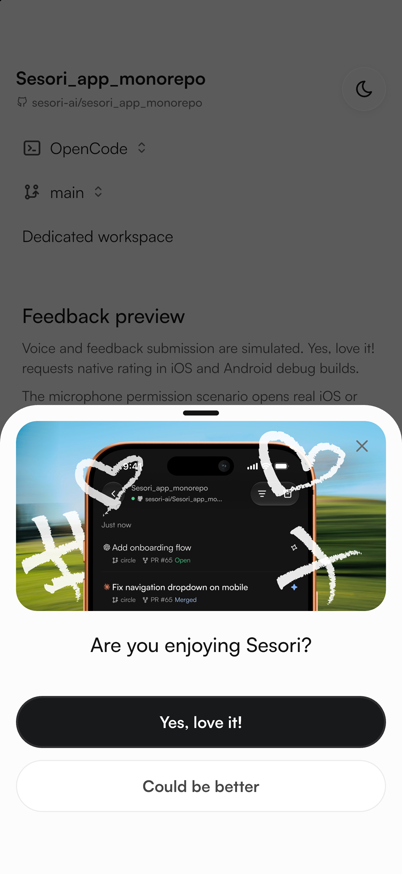
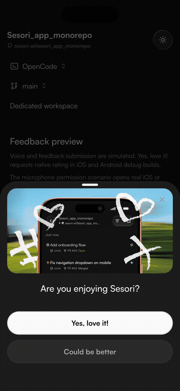
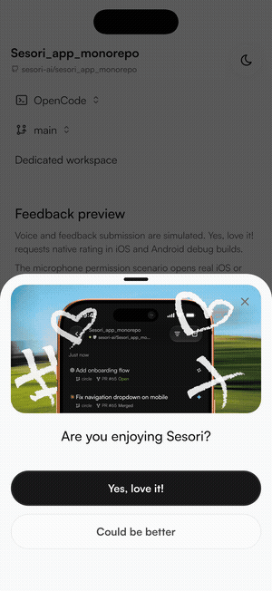
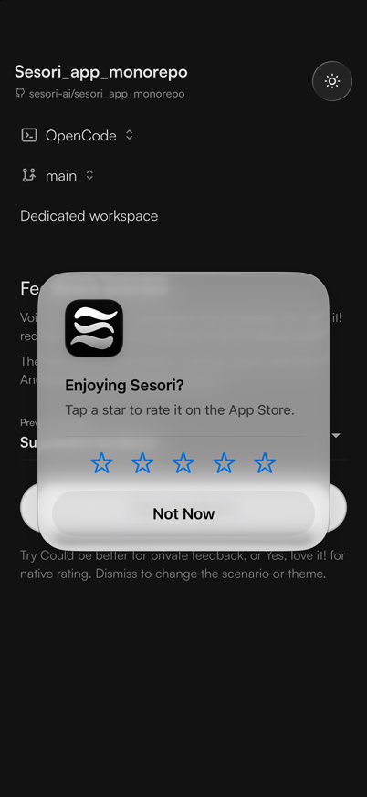
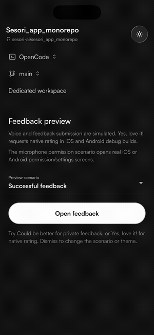
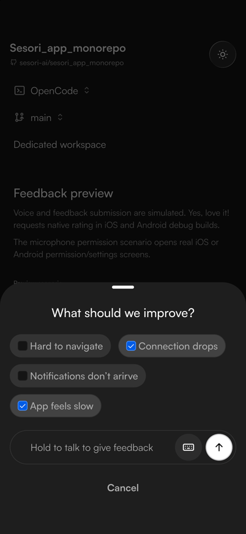
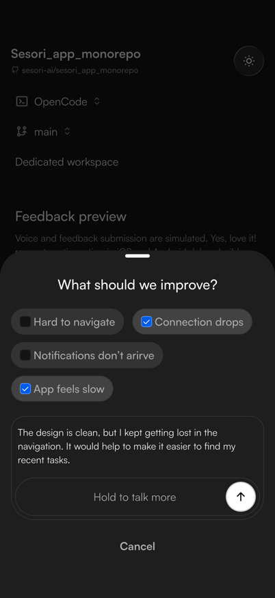
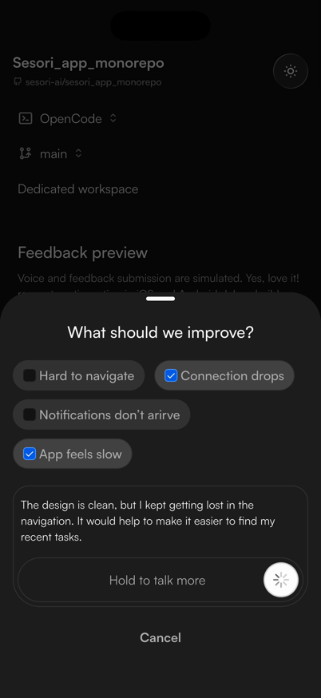
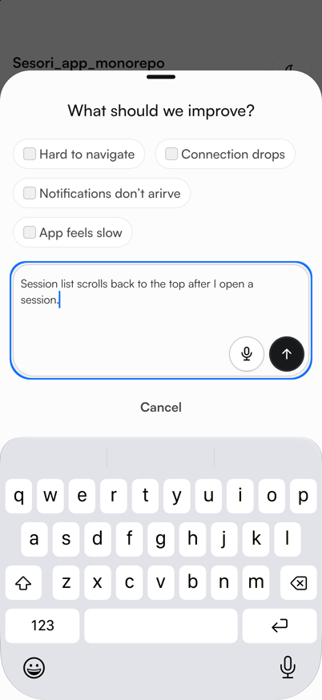

# Feedback preview (PR #1361) — UX review

iPhone 17 simulator, iOS 27, Flutter 3.47.5. Captured 2026-09-26.

## 1 · Entry sheet

**Dark**

**Light.** Open question: “Could be better” is white on white with only a faint outline.

## 2 · “Yes, love it!” → celebration → native review prompt

**Dark:** the button turns pink, hearts animate, the sheet closes, then the App Store prompt appears.

**Light:** the button goes from its dark fill to pink and back before the sheet closes.

**Apple’s real StoreKit prompt** (debug-only hook)

In the light run, the prompt appeared about 2 s after the tap. In the dark run, the first StoreKit call took about 3 s longer.

## 3 · “Could be better” → private feedback

**Full flow:** chips → hold to talk → transcript → send → toast

**Issue chips selected**

**After the simulated voice transcript**

**Confirmation toast**

**Keyboard mode (light), with focus ring**

