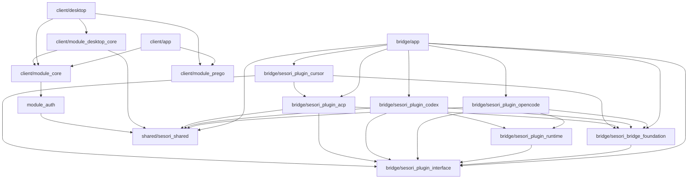
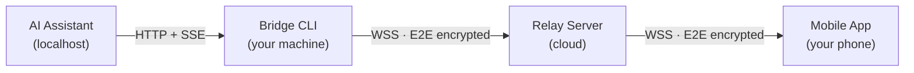

# Architecture Overview

This page is a high-level map of the Sesori monorepo. For the Bridge's layered code architecture, see [bridge/ARCHITECTURE.md](../bridge/ARCHITECTURE.md). For the runtime data flow, see [HOW_IT_WORKS.md](HOW_IT_WORKS.md).

## Repository structure

```
sesori_apps_monorepo/
├── bridge/                     # Dart workspace — Bridge CLI + plugin system
│   app/                        # Bridge CLI and plugin-agnostic orchestration
│   sesori_bridge_foundation/   # Bridge-wide runtime acquisition primitives
│   sesori_plugin_interface/    # Abstract plugin contract
│   sesori_plugin_runtime/      # Managed backend runtime supervision
│   sesori_plugin_opencode/     # OpenCode backend plugin
│   sesori_plugin_codex/        # Codex backend plugin
│   sesori_plugin_acp/          # Agent Client Protocol backend plugin
│   sesori_plugin_cursor/       # Cursor ACP backend plugin
├── client/                     # Flutter workspace — mobile + desktop shells
│   app/                        # Mobile Flutter UI shell
│   desktop/                    # Desktop Flutter product shell
│   module_core/                # Pure Dart business logic
│   module_desktop_core/        # Pure Dart desktop supervision and state
│   module_auth/                # Auth & token lifecycle
│   module_prego/               # Prego design system — theme, fonts, icons, UI components
├── shared/
│   sesori_shared/              # Shared crypto & protocol types
│   no_slop_linter/             # Custom Dart lint rules (dev tooling)
└── docs/                       # Deep-dive guides
```

`bridge/` and `client/` are independent Dart pub workspaces with separate dependency resolution. The packages under `shared/` are referenced via path by both: `sesori_shared` carries the crypto and protocol types, while `no_slop_linter` is a custom analyzer plugin pulled in as a dev dependency.

## Dependency graph



`shared/no_slop_linter` is omitted — it is a dev-only analyzer plugin, not a runtime dependency.

## Runtime data flow

At runtime, the components form a simple pipeline:



See [HOW_IT_WORKS.md](HOW_IT_WORKS.md) for the full breakdown of each hop and the encryption handshake.

## Design principles

- **Multiple surfaces and multiple bridges are first-class.** The code is organized so that phone, desktop, and future web shells stay thin, while the shared business logic stays surface-neutral.
- **Backend-specific behavior stays inside its plugin package.** Shared code and clients consume backend-neutral contracts and declared capabilities.
- **Bridge capabilities remain usable headlessly.** The Bridge CLI is a pure Dart tool with no GUI dependency, which makes it suitable for remote machines, VMs, and automation.
- **Local E2E and managed trusted modes are separate.** The same encryption path is used whether the app is on the same network or across the internet, and the relay never holds the keys.

## Workspace docs

- [bridge/README.md](../bridge/README.md) — Bridge CLI, plugin system, codegen, and testing.
- [bridge/ARCHITECTURE.md](../bridge/ARCHITECTURE.md) — Bridge layered architecture (Foundation → API → Repository → Service).
- [client/README.md](../client/README.md) — Flutter client, module structure, and testing.
- [shared/no_slop_linter/README.md](../shared/no_slop_linter/README.md) — custom lint rules and how they are wired in.
