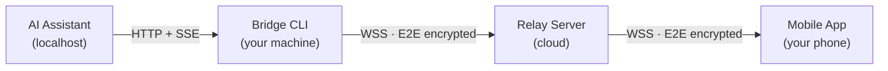

# Architecture Overview

This page is a high-level map of the Sesori monorepo. For the Bridge's layered code architecture, see [bridge/ARCHITECTURE.md](../bridge/ARCHITECTURE.md). For the runtime data flow, see [HOW_IT_WORKS.md](HOW_IT_WORKS.md).

## Repository structure

```
sesori_apps_monorepo/
├── bridge/                     # Dart workspace — Bridge CLI + plugin system
│   app/                        # Bridge CLI and plugin-agnostic orchestration
│   sesori_bridge_foundation/   # Bridge-wide runtime acquisition primitives
│   sesori_plugin_interface/    # Abstract plugin contract
│   sesori_plugin_runtime/      # Managed backend runtime supervision
│   sesori_plugin_opencode/     # OpenCode backend plugin
│   sesori_plugin_codex/        # Codex backend plugin
│   sesori_plugin_acp/          # Agent Client Protocol backend plugin
│   sesori_plugin_cursor/       # Cursor ACP backend plugin
│   sesori_plugin_copilot/      # GitHub Copilot ACP backend plugin
│   sesori_plugin_grok/         # Grok Build ACP backend plugin
│   sesori_plugin_deepseek/     # DeepSeek ACP backend plugin
│   sesori_plugin_omp/          # Oh My Pi ACP backend plugin
│   sesori_plugin_claude/       # Claude Code backend plugin
│   sesori_plugin_hermes/       # Hermes ACP backend plugin
│   sesori_plugin_pi/           # Pi backend plugin
├── client/                     # Flutter workspace — mobile + desktop shells
│   app/                        # Mobile Flutter UI shell
│   desktop/                    # Desktop Flutter product shell
│   module_core/                # Pure Dart business logic
│   module_desktop_core/        # Pure Dart desktop supervision and state
│   module_auth/                # Auth & token lifecycle
│   module_prego/               # Prego design system — theme, fonts, icons, UI components
├── shared/
│   sesori_shared/              # Shared crypto & protocol types
│   no_slop_linter/             # Custom Dart lint rules (dev tooling)
└── docs/                       # Deep-dive guides
```

`bridge/` and `client/` are independent Dart pub workspaces with separate dependency resolution. `sesori_shared` is referenced via path by both and carries the crypto and protocol types. `no_slop_linter` is a custom analyzer plugin pulled in as a dev dependency by client packages.

## Dependency graph


```mermaid
graph TD
  bridge_app[bridge/app] --> sesori_plugin_interface[bridge/sesori_plugin_interface]
  bridge_app --> sesori_bridge_foundation[bridge/sesori_bridge_foundation]
  bridge_app --> sesori_plugin_opencode[bridge/sesori_plugin_opencode]
  bridge_app --> sesori_plugin_codex[bridge/sesori_plugin_codex]
  bridge_app --> sesori_plugin_acp[bridge/sesori_plugin_acp]
  bridge_app --> sesori_plugin_cursor[bridge/sesori_plugin_cursor]
  bridge_app --> sesori_plugin_copilot[bridge/sesori_plugin_copilot]
  bridge_app --> sesori_plugin_grok[bridge/sesori_plugin_grok]
  bridge_app --> sesori_plugin_deepseek[bridge/sesori_plugin_deepseek]
  bridge_app --> sesori_plugin_omp[bridge/sesori_plugin_omp]
  bridge_app --> sesori_plugin_claude[bridge/sesori_plugin_claude]
  bridge_app --> sesori_plugin_hermes[bridge/sesori_plugin_hermes]
  bridge_app --> sesori_plugin_pi[bridge/sesori_plugin_pi]
  bridge_app --> sesori_shared[shared/sesori_shared]
  sesori_bridge_foundation --> sesori_plugin_interface
  sesori_plugin_runtime[bridge/sesori_plugin_runtime] --> sesori_plugin_interface
  sesori_plugin_runtime --> sesori_bridge_foundation
  sesori_plugin_opencode --> sesori_plugin_interface
  sesori_plugin_opencode --> sesori_bridge_foundation
  sesori_plugin_opencode --> sesori_plugin_runtime
  sesori_plugin_opencode --> sesori_shared
  sesori_plugin_codex --> sesori_plugin_interface
  sesori_plugin_codex --> sesori_bridge_foundation
  sesori_plugin_codex --> sesori_plugin_runtime
  sesori_plugin_codex --> sesori_shared
  sesori_plugin_acp --> sesori_plugin_interface
  sesori_plugin_acp --> sesori_bridge_foundation
  sesori_plugin_acp --> sesori_shared
  sesori_plugin_cursor --> sesori_plugin_interface
  sesori_plugin_cursor --> sesori_bridge_foundation
  sesori_plugin_cursor --> sesori_plugin_acp
  sesori_plugin_cursor --> sesori_plugin_runtime
  sesori_plugin_cursor --> sesori_shared
  sesori_plugin_copilot --> sesori_plugin_interface
  sesori_plugin_copilot --> sesori_bridge_foundation
  sesori_plugin_copilot --> sesori_plugin_acp
  sesori_plugin_copilot --> sesori_plugin_runtime
  sesori_plugin_grok --> sesori_plugin_interface
  sesori_plugin_grok --> sesori_bridge_foundation
  sesori_plugin_grok --> sesori_plugin_acp
  sesori_plugin_deepseek --> sesori_plugin_interface
  sesori_plugin_deepseek --> sesori_bridge_foundation
  sesori_plugin_deepseek --> sesori_plugin_acp
  sesori_plugin_deepseek --> sesori_plugin_runtime
  sesori_plugin_omp --> sesori_plugin_interface
  sesori_plugin_omp --> sesori_bridge_foundation
  sesori_plugin_omp --> sesori_plugin_runtime
  sesori_plugin_omp --> sesori_plugin_acp
  sesori_plugin_claude --> sesori_plugin_interface
  sesori_plugin_claude --> sesori_bridge_foundation
  sesori_plugin_claude --> sesori_shared
  sesori_plugin_hermes --> sesori_plugin_interface
  sesori_plugin_hermes --> sesori_bridge_foundation
  sesori_plugin_hermes --> sesori_plugin_acp
  sesori_plugin_pi --> sesori_plugin_interface
  sesori_plugin_pi --> sesori_bridge_foundation
  sesori_plugin_pi --> sesori_plugin_runtime
  sesori_plugin_pi --> sesori_shared

  mobile_app[client/app] --> module_core[client/module_core]
  mobile_app --> module_prego[client/module_prego]
  mobile_app --> module_auth[client/module_auth]
  mobile_app --> sesori_shared
  desktop_app[client/desktop] --> module_core
  desktop_app --> module_desktop_core[client/module_desktop_core]
  desktop_app --> module_auth
  desktop_app --> sesori_shared
  module_desktop_core --> module_core
  module_desktop_core --> sesori_shared
  module_core --> module_auth
  module_auth --> sesori_shared
```

`shared/no_slop_linter` is omitted — it is a dev-only analyzer plugin, not a runtime dependency. It is a dev dependency of the client packages, and `shared/sesori_shared` enables it as an analyzer plugin by path.

## Runtime data flow

At runtime, the components form a simple pipeline:


```mermaid
graph LR
  OC["AI Assistant<br/>(localhost)"] -- "HTTP + SSE" --> B["Bridge CLI<br/>(your machine)"]
  B -- "WSS · E2E encrypted" --> R["Relay Server<br/>(cloud)"]
  R -- "WSS · E2E encrypted" --> M["Mobile App<br/>(your phone)"]
```

See [HOW_IT_WORKS.md](HOW_IT_WORKS.md) for the full breakdown of each hop and the encryption handshake.

## Catalog ownership and the plugin boundary

The bridge owns the durable catalog of projects, sessions, and their
relationships. Plugins are execution harnesses and capability providers; they are
not the normal source for project and session list reads. Normal list requests
read only from the bridge-owned catalog and never enumerate enabled plugins, so
read cost depends on the returned page rather than on plugin count or the health
of the slowest backend.

The catalog is authoritative for what Sesori knows and presents. A plugin remains
authoritative for whether its backend can execute or resume an operation right
now. Persisting a last-known session does not prove the backend can still open
it; a temporarily unavailable plugin does not invalidate the durable entity.

**Sesori owns** projects and sessions known to Sesori, project-to-session and
parent-to-child relationships, plugin binding and backend-handle attribution,
bridge-owned names and archive or deletion intent, worktree, base-branch and
prompt-default metadata, unseen and activity state, and catalog provenance.

**Plugins own** agent execution and backend runtime state, transport and process
lifecycle, backend capabilities, models, agents, variants and commands, the
actual current operability of a backend session, and transcript retrieval.

### Update semantics

- Changes initiated through Sesori write through to the catalog immediately. A
  session created through Sesori appears at once; it never waits for a later
  backend enumeration.
- Plugin events may update list metadata and lifecycle state for sessions already
  known to Sesori, but they must not discover unrelated external root sessions or
  projects.
- Child sessions are the deliberate exception. An event may persist a child only
  when its parent or ancestor resolves to a known session from the same plugin;
  the child inherits that ancestry's project and plugin attribution. Nested
  children form a durable task hierarchy that root session lists exclude and that
  cascades when a parent is deleted through Sesori. An unresolved child may wait
  for its parent or use a targeted lookup under a known root; it must not trigger
  global plugin discovery.
- Work created directly in a harness enters through an explicit per-plugin
  **import**, not a sync: `POST`, `DELETE` and `GET /plugin/import` start, cancel
  and report it, and progress is emitted as plugin-attributed SSE. Import is
  non-destructive, and absence from a later import means only that the entity was
  not observed — never that it was deleted. Real unavailability is learned when a
  targeted operation returns a typed not-found result, not from a transient
  transport failure.

### Identity

A session separates its Sesori-owned id, the owning plugin id, and the opaque
backend session handle, with uniqueness enforced per `(plugin_id,
backend_session_id)`. Session controls resolve the durable binding and pass only
the backend handle to the owning plugin. Released peers that omit plugin identity
decode to OpenCode, because that was the only backend they could target; this
legacy identity is distinct from the enabled order and must never mean "first
enabled plugin". Projects remain one cross-plugin entity per directory with
shared hide, name and base-branch metadata. The catalog is per-bridge and does
not replace the separate multi-bridge addressing axis.

### Parallel runtime

The bridge resolves repeated `--plugin <id>` flags in order, otherwise ordered
persisted `enabledPlugins`, otherwise the sole OpenCode default. It starts,
monitors, degrades and stops plugins independently, routes session controls
through each stored binding, and preserves one shared project space across
plugins. A plugin outage degrades execution for its bound sessions without
removing their durable records. The client discovers the bridge-authored ordered
plugin list, selects its default when routable, and scopes saved agent, model and
variant choices by project and plugin.

This direction deliberately makes direct harness usage a secondary workflow:
external work appears after import, and imported metadata may be stale until
another import or a live event updates it.

## Design principles

- **Multiple surfaces and multiple bridges are first-class.** The code is organized so that phone, desktop, and future web shells stay thin, while the shared business logic stays surface-neutral.
- **Backend-specific behavior stays inside its plugin package.** Shared code and clients consume backend-neutral contracts and declared capabilities.
- **Bridge capabilities remain usable headlessly.** The Bridge CLI is a pure Dart tool with no GUI dependency, which makes it suitable for remote machines, VMs, and automation.
- **Local E2E and managed trusted modes are separate.** The same encryption path is used whether the app is on the same network or across the internet, and the relay never holds the keys.

## Workspace docs

- [bridge/README.md](../bridge/README.md) — Bridge CLI, plugin system, codegen, and testing.
- [bridge/ARCHITECTURE.md](../bridge/ARCHITECTURE.md) — Bridge layered architecture (Foundation → API → Repository → Service).
- [client/README.md](../client/README.md) — Flutter client, module structure, and testing.
- [shared/no_slop_linter/README.md](../shared/no_slop_linter/README.md) — custom lint rules and how they are wired in.
