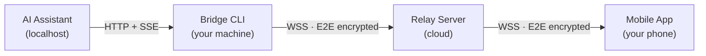

# How it works

Sesori connects the AI coding assistant on your laptop or desktop to a mobile app on your phone through a lightweight Bridge. Everything stays local-first and end-to-end encrypted.

## The three pieces

| Piece | What it does | Where it runs |
|---|---|---|
| **Sesori app** | The mobile interface you interact with. | iOS, Android |
| **Sesori Bridge CLI** | Sits between the relay and the assistant, handles auth, and forwards encrypted requests. | Your laptop or desktop |
| **Sesori relay server** | Routes encrypted traffic between app and Bridge. | Cloud |

The AI coding assistant itself is a separate project. Today Sesori connects to [OpenCode](https://opencode.ai), and **OpenAI Codex CLI** and **Cursor** are available in beta; support for more assistants lives in the plugin system.

## Runtime topology

At runtime, four components form a pipeline:

## How each hop works

### Bridge ↔ AI Assistant (localhost)

The Bridge talks to the AI assistant over plain HTTP on `127.0.0.1`. It fetches projects and sessions via REST, and subscribes to a Server-Sent Events (SSE) stream for real-time updates (new messages, status changes, questions). By default, a locally generated random 256-bit password protects the local connection. You can override this with `--opencode-password <value>` or disable it with `--opencode-no-password` (loopback only in managed mode).

### Bridge ↔ Relay (WebSocket)

The Bridge opens a persistent WebSocket to the relay server and authenticates with an OAuth access token. All application data sent over this connection is encrypted. The relay sees routing and auth metadata (auth tokens, public keys, device identifiers) and opaque binary application frames, and routes them by user identity.

### Phone ↔ Relay (WebSocket)

The mobile app opens its own WebSocket to the same relay, authenticates the same way, and receives binary frames destined for it. The relay is a stateless router.

### Phone ↔ Bridge (end-to-end, through the relay)

When a phone connects, it performs an **X25519 Diffie-Hellman key exchange** with the Bridge. Both sides derive a shared secret via HKDF-SHA256, and the Bridge sends a random **room key** encrypted with that secret. From that point on, every message — HTTP requests, responses, and SSE events — is encrypted with **XChaCha20-Poly1305** using the room key. The relay never has access to the key material.

## Message types

| Direction | What travels | Example |
|---|---|---|
| Phone → Bridge | HTTP requests (encrypted) | `GET /project`, `GET /session/:id/message` |
| Bridge → Phone | HTTP responses (encrypted) | Project list, session messages |
| Bridge → Phone | SSE events (encrypted) | New message, session status change, question asked |
| Phone → Bridge | SSE subscribe/unsubscribe | Start/stop receiving events for a session |
| Both | Key exchange, resume, rekey | Connection lifecycle |

## Session resume and rekeying

The room key is persisted on the phone so reconnects can skip the key exchange while the same Bridge session is still running. A Bridge restart, a `rekey_required` signal, or a failed resume forces a fresh exchange.

## Why a Bridge is needed

The app on your phone cannot talk directly to OpenCode for a few reasons:

- **Any network.** The Bridge registers with the relay, so your phone can connect from anywhere, not just the same Wi-Fi as your laptop.
- **Push notifications.** The Bridge knows when a session needs input or finishes, and triggers the push that wakes your phone.
- **Plugin updates.** New assistants and compatibility fixes ship in the Bridge, outside Apple or Google review cycles.
- **Source-available.** You can audit exactly what is running on your machine.

For the cryptography details, see [SECURITY.md](SECURITY.md). For the repository layout, see [ARCHITECTURE.md](ARCHITECTURE.md).
