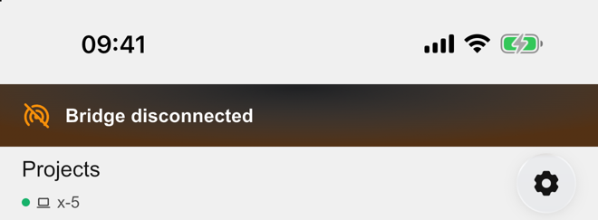
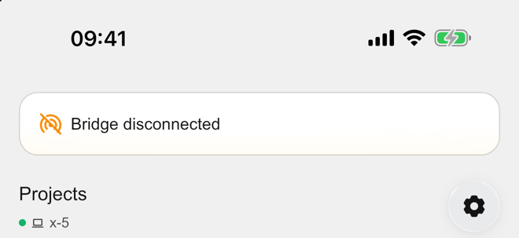
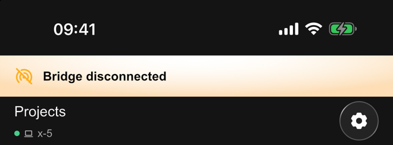
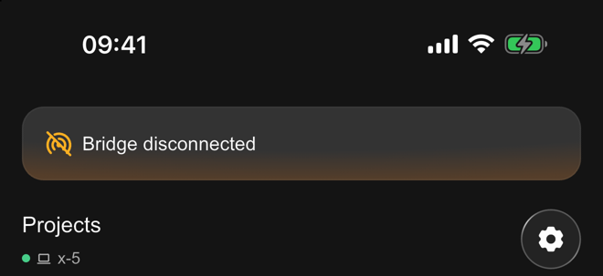

# Inline alert design comparison

Reference: [Figma project reconnect screen](https://www.figma.com/design/NILKXLD9cwuWHhLnGqPqeJ/Sesori?node-id=2325-48313), inline-alert instance `4903:34868`.

Captured on the iPhone 17 Pro Max simulator (iOS 26.5, 440 × 956 logical pixels).
The images are top-of-screen crops, resized uniformly to half the original
pixel resolution, to show the status bar, alert, and navigation without uploading
the user's unrelated project names and paths. The status-bar time was already
overridden to 09:41 in this simulator; it was left unchanged.

| Appearance | Before | After |
| --- | --- | --- |
| Light |  |  |
| Dark |  |  |

## Reproduction and boundaries

Both builds used the same temporary presentation-only override in
`ConnectionBanner.maybeFor`: return `const ConnectionBanner()` when the local
`QA_BRIDGE_OFFLINE` build define is true. The simulator remained signed in and
connected to the live bridge; the connected subtitle is intentional. No bridge
restart, network interruption, session mutation, or prompt was performed.
These screenshots validate the real screen layout, not outage detection.

The override was removed after capture, and a normal build was installed.
The banner disappeared and navigation returned to its original position.
The original app and simulator Dark appearance settings were restored.
Widget tests separately cover state mapping, reconnect actions, live-region
semantics, and banner entrance/recovery with the full padded card height.
